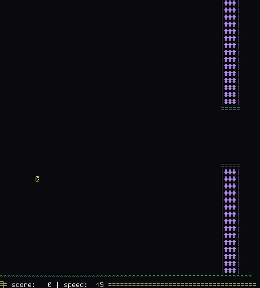

# flap

Simple TUI Flappy Bird clone for Linux. This project uses pretty much standard POSIX terminal API,
so it could possibly be ported to other OSes, but currently it's only know to work in GNU/Linux.



# Quick start

```console

make
./flap 
#controls: press space to flap

```
